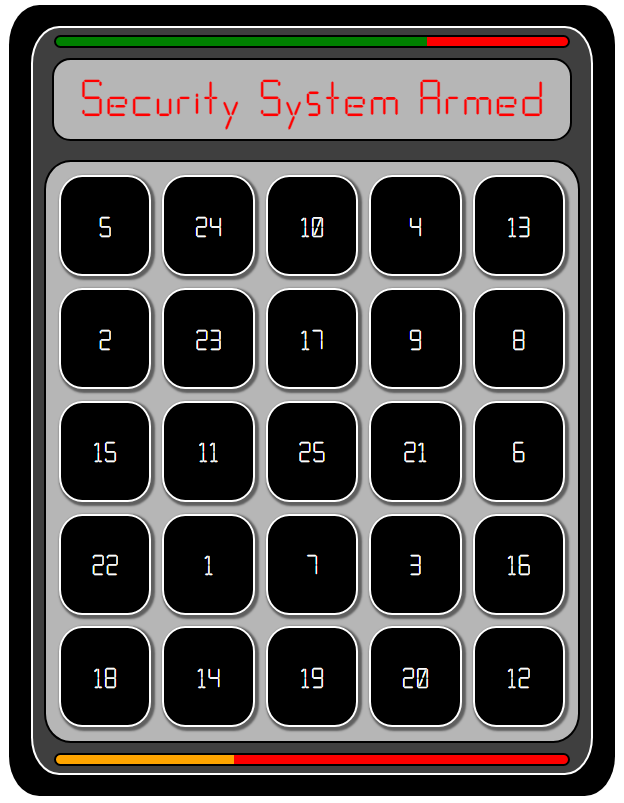
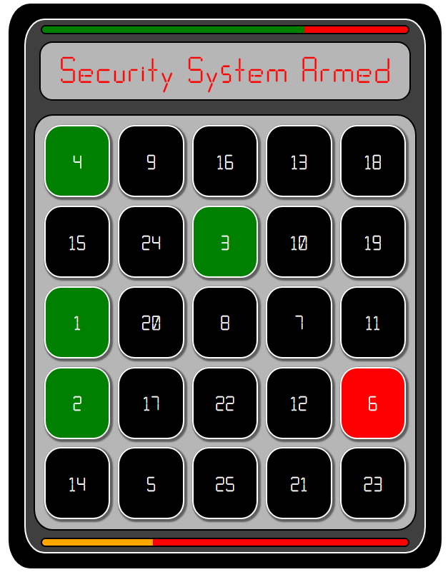
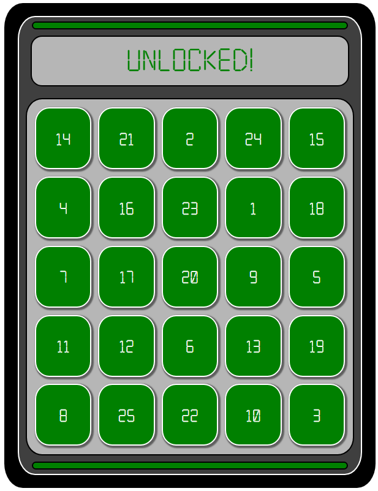
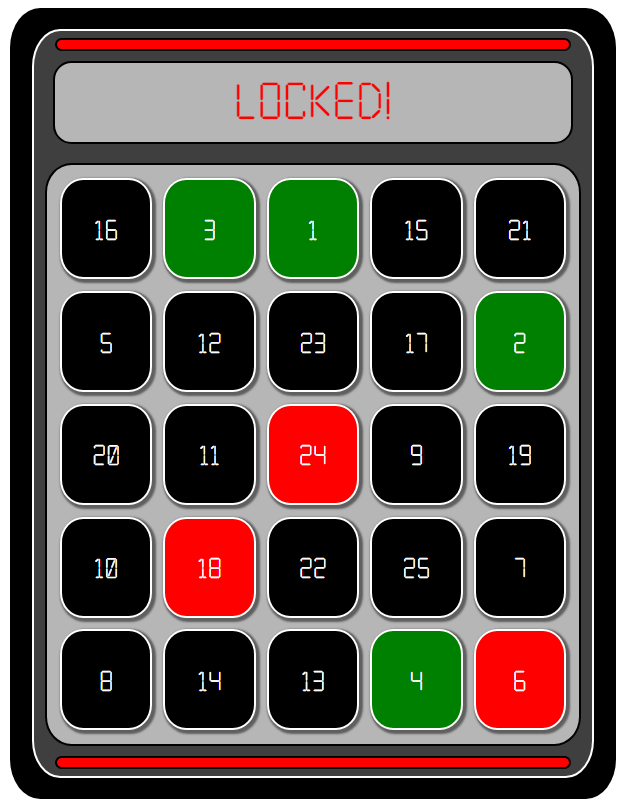

# Cujion-NumberUp-Minigame
# Usage

Put the folder in your resources and start in resources.cfg
``ensure Cujion-NumberUp``

# Visuals





# How to use export

```
    -- numRows = Number of grid rows (min-1/max-11)
    -- numCols = Number of grid cols (min-1/max-11)
    -- gameDuration = length in secs you have to finish minigame
    -- shuffleInterval = length in seconds you have before grid shuffle
    -- maxWrong = maximum number of wrong inputs

RegisterCommand('NumberUp', function(source, args)
    exports["Cujion-NumberUp"]:cujionnumberup(
    function(success)
        if success then
            print("success")
        else
            print('failed')
        end
    end, 5, 5, 30, 5, 3) --numRows(1-11), numCols(1-11), gameDuration(secs), shuffleInterval(secs), maxWrong
end)

exports["Cujion-NumberUp"]:cujionnumberup(
function(success)
    if success then
        print("success")
    else
        print('failed')
    end
end, 5, 5, 30, 5, 3) --numRows(1-11), numCols(1-11), gameDuration(secs), shuffleInterval(secs), maxWrong

```
